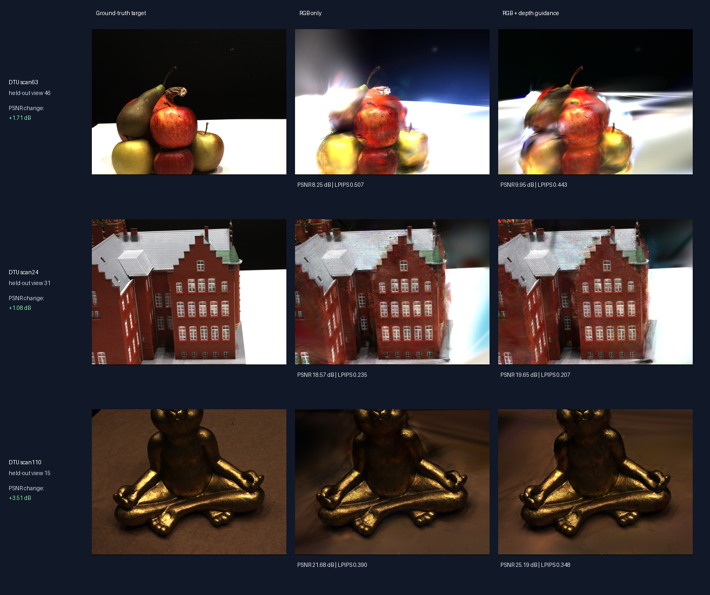

# Sparse-View 3D Gaussian Splatting

Educational implementation of the 3D Gaussian Splatting (3DGS) pipeline, along with a brief
extension experiment.

We test whether monocular depth guidance can reduce overfitting when the
model is trained from only a few camera views with aggressive densification. We
compare RGB-only and depth-guided training across three DTU scenes and three random
seeds.

## Bringup

Use Python 3.11 and [`uv`](https://docs.astral.sh/uv/):

```bash
uv sync --extra dev --extra data
uv run gsplat-learn status
uv run pytest
```

## Results

| Scene | Test PSNR | LPIPS | Depth AbsRel |
| --- | ---: | ---: | ---: |
| scan63 | **+1.617 +/- 0.467 dB** | **-0.0583 +/- 0.0130** | **-0.0123 +/- 0.0052** |
| scan24 | **+0.322 +/- 0.694 dB** | **-0.0049 +/- 0.0148** | **-0.0015 +/- 0.0006** |
| scan110 | **+1.267 +/- 1.348 dB** | **-0.0308 +/- 0.0111** | **-0.0036 +/- 0.0009** |

Across the nine comparisons, depth guidance reduced depth error every time. It also improved image quality in most runs: PSNR improved in eight of nine comparisons, while LPIPS improved in seven.



The figure shows held-out views with PSNR improvements close to the typical result for each scene. Although depth guidance usually improves the overall image metrics, it does not improve every part of an image. For example, scan63 still shows noticeable stretching and smearing artifacts.

## Evaluation

- **PSNR:** Pixel-level similarity to the target image; higher is better.
- **LPIPS:** Perceptual image difference; lower is better.
- **Depth AbsRel:** Average relative error between rendered and reference camera-space
  depth; lower is better. An AbsRel of `0.06` is roughly 6% relative depth error.
- **Train-test PSNR gap:** Difference between training-view and held-out-view quality;
  a large gap is evidence of overfitting.

## Experiment Phases

### Phase 1: Establish trainable baseline

**Purpose:** Implement the theory from scratch for learning purposes, then verify that each moving part (projection, covariance, compositing, optimization, adaptive clone/split/prune) of the pipeline workds before running experiments.

To move on, we test that 50-fold loss reduction and 45 dB PSNR work on a synthetic scene:

```bash
uv run pytest -q -s \
  tests/student/test_phase_1_overfit.py::test_tiny_synthetic_scene_overfits
uv run gsplat-learn train --config configs/dtu_scan63_density_smoke.yaml
```

**Result:** PyTorch implementation and CUDA backend share the
same camera, image, rendering, and checkpoint contracts. The baseline can optimize a
scene end to end and update its Gaussian topology during training.

### Phase 2: Make held-out quality measurable

**Purpose:** Separate training-image fit from novel-view performance and add an
independent depth measurement.

```bash
uv sync --extra dev --extra data --extra cuda --extra evaluation
uv run gsplat-learn train --config configs/dtu_scan63_holdout.yaml
uv run gsplat-learn evaluate --config configs/dtu_scan63_holdout.yaml
uv run gsplat-learn plot outputs/dtu_scan63_holdout
```

**Result:** Evaluation writes per-camera JSON/CSV metrics and aligned RGB, alpha, and
depth renders under each run's `evaluation/` directory. This fixed evaluation path is
used by every later comparison.

### Phase 3: Sparse-view overfitting

**Purpose:** We aim to answer the question: *Does allowing the model to create more
Gaussians improve reconstruction when only a few camera views are available—or does
it encourage memorization?*

We run four versions of the same experiment, varying only the number of training
views and the densification setting. Everything else (initial 3D points, test cameras,
optimizer, seed, and training duration) stays fixed. "Aggressive" densification lowers
the threshold for adding Gaussians, giving the model more capacity to fit the images.

| Training setup | Train PSNR | Held-out PSNR | Train-test gap | LPIPS | Final Gaussians |
| --- | ---: | ---: | ---: | ---: | ---: |
| 39 views, baseline (`0.001`) | 29.60 dB | 22.08 dB | 7.52 dB | 0.212 | 75.3K |
| 39 views, aggressive (`0.0005`) | 35.00 dB | 28.57 dB | 6.44 dB | 0.118 | 206.1K |
| 4 views, baseline (`0.001`) | 31.41 dB | 11.52 dB | 19.89 dB | 0.509 | 12.2K |
| 4 views, aggressive (`0.0005`) | 38.40 dB | 10.17 dB | 28.23 dB | 0.521 | 31.9K |

With 39 views, aggressive densification improves both the training and held-out
renders. With only four views, it raises training PSNR by **6.99 dB** but lowers
held-out PSNR by **1.34 dB**. At the same time, the train-test gap grows by
**8.34 dB** and the model creates **2.6 times** as many Gaussians. Training quality
and unseen-view quality move in opposite directions, which is the clearest sign of
memorization.

**Result:** Phase 3 isolates sparse views plus aggressive densification as the failure
case that depth guidance targets in Phases 4 and 5.

### Phase 4: Add monocular depth

**Purpose:** Give the sparse model an additional cue about how far scene content should
be from each camera, without changing the renderer or densification schedule.

Depth Anything V2 is used as an offline depth estimator; it is not retrained with the
Gaussian model. It processes each training image once and predicts which parts of the
image are closer to or farther from the camera. Because a single-image prediction does
not know the scene's true scale, visible COLMAP points are used to align it with the
3D reconstruction. Predictions that cannot be aligned reliably are rejected.

The saved, aligned depth maps then become fixed training targets. The RGB loss still
teaches the model what the scene should look like, while the added depth loss
discourages it from placing scene content at implausible distances:

```text
total_loss = rgb_loss + 0.1 * smooth_l1(log(rendered_depth) - log(prior_depth))
```

```bash
uv sync --extra dev --extra data --extra cuda --extra evaluation --extra depth
uv run gsplat-learn generate-depth-priors \
  --config configs/phase4/dtu_scan63_sparse_aggressive_depth.yaml
```

**Result:** Phase 4 produces one validated depth map for each sparse training view.
These maps act as geometric guardrails in Phase 5: the Gaussian model can no longer
improve its color match as easily by putting content at the wrong depth. The depth
estimator and its saved predictions remain fixed, so the next experiment isolates the
effect of adding depth guidance.

### Phase 5: Test the intervention on the failing condition

**Purpose:** Compare RGB-only training with RGB + depth on the sparse,
aggressively densified scan63 condition identified in Phase 3.

```bash
uv run gsplat-learn train \
  --config configs/phase4/dtu_scan63_sparse_aggressive_depth.yaml
uv run gsplat-learn evaluate \
  --config configs/phase4/dtu_scan63_sparse_aggressive_depth.yaml
uv run gsplat-learn plot outputs/phase4_dtu_scan63/sparse_aggressive_depth
```

| Metric | RGB only | RGB + Depth | Change |
| --- | ---: | ---: | ---: |
| Held-out PSNR | 10.17 dB | 11.94 dB | **+1.77 dB** |
| LPIPS | 0.5215 | 0.4635 | **-0.0580** |
| Depth AbsRel | 0.0672 | 0.0608 | **-9.6%** |
| Train-test PSNR gap | 28.23 dB | 23.70 dB | **-4.52 dB** |
| Final Gaussians | 31.9K | 29.2K | **-2.6K** |

**Result:** Depth guidance improves held-out depth and appearance while reducing the
generalization gap, without relying on a larger model.

### Phase 6: Validate across scenes and seeds

**Purpose:** The final experiment compares RGB-only and depth-guided training on DTU
scans 24, 63, and 110 with random seeds 42, 7, and 123.

```bash
uv run gsplat-learn phase6-run --scene all --condition both --seed all
uv run gsplat-learn phase6-report
```

### Conclusion

The experiment shows that aligned monocular depth
regularization consistently improves held-out sparse-depth accuracy and usually
improves novel-view appearance under sparse camera supervision. It does not yet
establish better complete-surface geometry.

### Learning Outcomes

1. Explain why anisotropic Gaussians use scale plus rotation and how their covariance
   projects through a perspective camera.
2. Derive front-to-back alpha compositing and discuss its numerical and gradient behavior.
3. Explain spherical harmonics as a compact view-dependent color model.
4. Design parameter-specific optimization and adaptive clone/split/prune rules.
5. Validate a readable reference implementation against an optimized CUDA operator.
6. Diagnose camera-convention, coordinate-system, visibility, and numerical-stability bugs.
